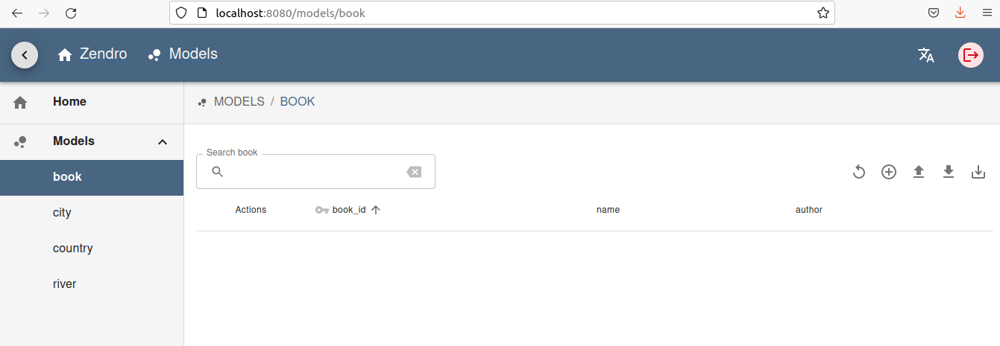
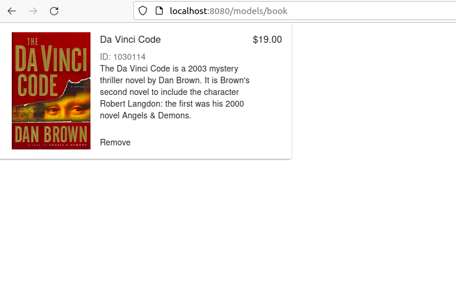

<h1 align=center> Zendro Frontend</h1>

<p align=center>A generic web application to send CRUD requests to a Zendro GraphQL API.</p>


## Description

This application offers a generic graphical user interface to send CRUD requests to a Zendro-enabled GraphQL endpoint, and can serve as a starting point to design a fully customized user experience for your project.

The project leverages [Next.js](https://nextjs.org/) APIs to create a static site that is tailored specifically to support your custom data models, and contains all the necessary functionality used to communicate with the Zendro backend.

## Setup

Two steps are required before using the Zendro frontend:

- Adding your custom data model definitions (using our unified JSON schema format) to a folder, defined by `ZENDRO_DATA_MODELS` environment variable.
- Configuring of the Zendro GraphQL endpoint to be used. This is done in the `env.local` file.

### Data Models

Each model is an independent file that describes the shape, or schema, of one data set. These models also include the relations, or associations, that they have with other models.

To facilitate the development process, we use a unified `JSON` format that works in both Zendro backend and frontend projects. To learn more about how to set up data models, please visit our documentation on [how to define data models for developers](https://zendro-dev.github.io/setup_data_scheme.html). We also have available [documentation for non-developers](https://zendro-dev.github.io/non-developer_documentation.html) with a more abstract approach.

### Configuration

For the Zendro frontend to know the location of its GraphQL endpoint, as well as other parameters required for its functionality, several environmental variables need to be defined in either a `.env`, `.env.local`, or `.env.production` file.

This file is also used by Next.js to set any environment variables that should be available to either the built-in generator, or in the browser. Read more about Next.js environmental variables [in the official documentation](https://nextjs.org/docs/basic-features/environment-variables).

For security reasons, `env.local` is never committed to the remote repository. However, we have included a `.env.development` file with some reasonable defaults that may be used in development. In production, you can copy `.env.development` to a new `.env.production` file and modify it accordingly.

Below there is a brief explanation of what each variable is used for.

```bash
# GraphQL endpoint address. Used to send data queries and mutations.
NEXT_PUBLIC_ZENDRO_GRAPHQL_URL='http://localhost:3000/graphql'

# Endpoing login address. Used for authentication.
NEXT_PUBLIC_ZENDRO_LOGIN_URL='http://localhost:3000/login'

# GraphQL meta-query endpoint address. Used to send meta- queries and mutations.
NEXT_PUBLIC_ZENDRO_METAQUERY_URL='http://localhost:3000/meta_query'

# Maximum allowed upload size in megabytes.
NEXT_PUBLIC_ZENDRO_MAX_UPLOAD_SIZE=500

# Maximum number of records that can be returned per request.
NEXT_PUBLIC_ZENDRO_MAX_RECORD_LIMIT=10000

# relative path from the root of the directory to your models folder
ZENDRO_DATA_MODELS='../data_model_definitions'
```

#### Sending GraphQL Requests

The standard Zendro GraphQL Server exposes two different APIs to send requests, a standard GraphQL endpoint in `/graphql`, and a **Meta-Query** endpoint in `/meta_query`. This latter route accepts either a `jq` or `jsonpath` header with special syntax to further process the contents of the GraphQL `data` object in the server. After the processing is complete, the modified `data` is sent in the response. This feature allows us to statically serve complex parsing instructions along with the queries and mutations data.

This is an optional feature for custom implementations, but the default CRUD interface provided with the SPA uses the `/meta_query` endpoint extensively to function. Meaning, that the default application requires that the `NEXT_PUBLIC_ZENDRO_METAQUERY_URL` is set correctly, and the `/meta_query` endpoint accessible to `reader` roles.

## Development

To start a development server, the following command is available.

```bash
yarn dev
# or to serve it from a custom port
PORT=5000 yarn dev
```

- Open [http://localhost:8080](http://localhost:8080) with your browser to see the result.
- You can start editing the page by modifying `pages/index.js`. The page auto-updates as you edit the file.
- The `pages/api` directory is mapped to `/api/*`. Files in this directory are treated as [API routes](https://nextjs.org/docs/api-routes/introduction) instead of React pages.


## Testing

The Zendro application uses the [Cypress](https://docs.cypress.io/guides/overview/why-cypress) framework for end-to-end/integration testing. We do _not_ mock any data, which implies the necessity of a running zendro graphql [backend](https://github.com/Zendro-dev/graphql-server). Testing can be done in either of two ways

### Interactive real time testing

While developing the application in a Sandbox tests can be interactively run in either the cypress dashboard using
```bash
yarn cy:open
```
or the cypress CLI using
```bash
yarn cy:run
```
Using the cypress dashboard comes with several build in advantages, which can be very helpful debugging:
* When serving the application in development mode cypress will watch file changes and rerun tests accordingly
* Step-by-step feedback for every test and the possibility to go back in time via DOM snapshots
* manually run tests in isolation or run the full suite

### Full test run
In case there is no active backend to run the tests again a full test run can be performed using
```bash
yarn test-integration
```
This will setup a test environment including a graphql-server and graphql-server-model-codegen to generate the backend code, as well as building the application, serving it and running the full test suite.

Run
```bash
yarn test-integration -h
```
for more help and possible run-options.
### Writing tests
Test files and tests can be added in the `/cypress` folder at the root of the project. See the [docs](https://docs.cypress.io/guides/core-concepts/writing-and-organizing-tests#Folder-Structure) for more information.
### Coverage
E2E code coverage collected during each test is done via `@cypress/code-coverage` plugin. t merges coverage from each test and saves the combined result. It also calls nyc (its peer dependency) to generate static HTML reports for human consumption in `/coverage`. See the [docs](https://docs.cypress.io/guides/tooling/code-coverage#E2E-code-coverage) for more information
## Deployment

### Static Application

The default Zendro application is configured as a fully static site. The final build can be generated, and optionally previewed, via the following commands.

```bash
yarn build    # build the application in `.next` folder
yarn export   # export to `out` folder as as a static site
yarn serve    # preview the exported static site
```

Once the `out` folder is generated, it can be served as static content from a custom webserver, for example using [NGINX](https://docs.nginx.com/nginx/admin-guide/web-server/serving-static-content/), or deployed to a static hosting site, such as [Netlify](https://www.netlify.com/blog/2020/11/30/how-to-deploy-next.js-sites-to-netlify/) or [Github Pages](https://pages.github.com).

### Hybrid Application

If you have modified the application to use server-side logic, for example by adding support for [Incremental Static Generation](https://nextjs.org/blog/next-9-3#next-gen-static-site-generation-ssg-support) or [Server-Side Rendering](https://nextjs.org/docs/basic-features/pages#server-side-rendering), a Node.js server is required to host the application.

```bash
yarn build    # build the application in `.next` folder
yarn start    # serve the application using the provided Node.js server
```

Alternatively, you can deploy to the [Vercel Platform](https://vercel.com/new?utm_medium=default-template&filter=next.js&utm_source=create-next-app&utm_campaign=create-next-app-readme) from the creators of Next.js. Check out the [Next.js deployment documentation](https://nextjs.org/docs/deployment) for more details.

## Customization

### Custom Pages

Routes in the application automatically mirror the structure of the pages folder. The default static site contains a dynamic `[model]` route, with a home page ([`index.tsx`](./src/pages/[model]/index.tsx)) to display an interactive table of records, and one child route ([`item.tsx`](./src/pages/[model]/item.tsx)) to display data for a single record.

Overriding a model route with a custom page only requires to provide an appropriately named file within the pages folder. Because in Next.js predefined routes take precedence over dynamic routes, all requests for that model will now point to the new page.

Let's take a book model as an example, which by default is dynamically rendered by `[model]/index.tsx` and can be accessed via the browser at 'http://localhost:8080/models/book'. If this page is to be overridden by a custom page, all that needs to be done is to create a file named `book.tsx` in the pages folder. The following figure illustrates this idea

```
pages
├── [model]
│   ├── index.tsx
│   └── [item].tsx
|   └── book.tsx
|
├── index.tsx
└── login.tsx
```
### Demonstration

Consider we have the books data model
```
{
    "model": "book",
    "storageType": "sql",
    "attributes": {
      "book_id": "String",
      "name": "String",
      "author": "String"
    },
    "internalId": "book_id"
  }
```
It appears as follows on our SPA


Now, to override this page lets create an empty 'books.tsx' file and place it in the '/src/pages/models' folder and past the following code in it

```
import * as React from 'react';
import { styled } from '@mui/material/styles';
import Grid from '@mui/material/Grid';
import Paper from '@mui/material/Paper';
import Typography from '@mui/material/Typography';
import ButtonBase from '@mui/material/ButtonBase';

const Img = styled('img')({
  margin: 'auto',
  display: 'block',
  maxWidth: '100%',
  maxHeight: '100%',
});

export default function ComplexGrid() {
  return (
    <Paper
      sx={{
        p: 2,
        mr:100,
        // margin: 'auto',
        maxWidth: 500,
        flexGrow: 1,
        backgroundColor: (theme) =>
          theme.palette.mode === 'dark' ? '#1A2027' : '#fff',
      }}
    >
      <Grid container spacing={1}>
        <Grid item>
          <ButtonBase sx={{ width: 150, height: 200 }}>
            
          </ButtonBase>
        </Grid>
        <Grid item xs={12} sm container>
          <Grid item xs container direction="column" spacing={2}>
            <Grid item xs>
              <Typography gutterBottom variant="subtitle1" component="div">
                Da Vinci Code
              </Typography>
              <Typography variant="body2" color="text.secondary">
                ID: 1030114
              </Typography>
              <Typography variant="body2" gutterBottom>
              The Da Vinci Code is a 2003 mystery thriller novel by Dan Brown. It is Brown's second novel to include the character Robert Langdon: the first was his 2000 novel Angels & Demons. 
              </Typography>
           
            </Grid>
            <Grid item>
              <Typography sx={{ cursor: 'pointer' }} variant="body2">
                Remove
              </Typography>
            </Grid>
          </Grid>
          <Grid item>
            <Typography variant="subtitle1" component="div">
              $19.00
            </Typography>
          </Grid>
        </Grid>
      </Grid>
    </Paper>
  );
}


```
Now the same root for the book model appears as follows on our SPA


### Next.js Resources

To learn more about Next.js, take a look at the following resources:

- [Next.js Documentation](https://nextjs.org/docs) - learn about Next.js features and API.
- [Learn Next.js](https://nextjs.org/learn) - an interactive Next.js tutorial.


## Troubleshooting

### Husky and Lint-Staged

To both keep formatting consistent and catch potential errors in the project, this repository uses an ESLint + Prettier setup. On every commit, a [Husky](https://github.com/typicode/husky) git hook is configured to lint and format staged files.

When trying to commit, the following error may occur:

> Command "husky-run" not found

If this happens, please make sure you have run the following commands in your terminal.

```bash
yarn install          # install node modules
yarn husky install    # install git hooks
```

## Contributions
Zendro is the product of a joint effort between the Forschungszentrum Jülich, Germany and the Comisión Nacional para el Conocimiento y Uso de la Biodiversidad, México, to generate a tool that allows efficiently building data warehouses capable of dealing with diverse data generated by different research groups in the context of the FAIR principles and multidisciplinary projects. The name Zendro comes from the words Zenzontle and Drossel, which are Mexican and German words denoting a mockingbird, a bird capable of “talking” different languages, similar to how Zendro can connect your data warehouse from any programming language or data analysis pipeline.

### Zendro contributors in alphabetical order
Francisca Acevedo<sup>1</sup>, Vicente Arriaga<sup>1</sup>, Katja Dohm<sup>3</sup>, Constantin Eiteneuer<sup>2</sup>, Sven Fahrner<sup>2</sup>, Frank Fischer<sup>4</sup>, Asis Hallab<sup>2</sup>, Alicia Mastretta-Yanes<sup>1</sup>, Roland Pieruschka<sup>2</sup>, Alejandro Ponce<sup>1</sup>, Yaxal Ponce<sup>2</sup>, Francisco Ramírez<sup>1</sup>, Irene Ramos<sup>1</sup>, Bernardo Terroba<sup>1</sup>, Tim Rehberg<sup>3</sup>, Verónica Suaste<sup>1</sup>, Björn Usadel<sup>2</sup>, David Velasco<sup>2</sup>, Thomas Voecking<sup>3</sup>

#### Author affiliations
1. CONABIO - Comisión Nacional para el Conocimiento y Uso de la Biodiversidad, México
2. Forschungszentrum Jülich - Germany
3. auticon - www.auticon.com
4. InterTech - www.intertech.de

### Zendro author contributions
Asis Hallab and Alicia Mastretta-Yanes coordinated the project. Asis Hallab designed the software. Programming of code generators, the browser based single page application interface, and the GraphQL application programming interface was done by Katja Dohm, Constantin Eiteneuer, Francisco Ramírez, Tim Rehberg, Veronica Suaste, David Velasco, Thomas Voecking, and Dan Wang. Counselling and use case definitions were contributed by Francisca Acevedo, Vicente Arriaga, Frank Fischer, Roland Pieruschka, Alejandro Ponce, Irene Ramos, and Björn Usadel. User experience and application of Zendro on data management projects was carried out by Asis Hallab, Alicia Mastretta-Yanes, Yaxal Ponce, Irene Ramos, Verónica Suaste, and David Velasco. Logo design was made by Bernardo Terroba.
